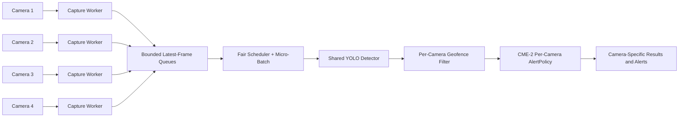

# SED-1 Multi-Camera Stream Architecture

SED-1 extends the existing single-stream detector into a concurrent 1-4 camera
pipeline for industrial monitoring demos.

## Architecture



The detector is shared. Each camera has its own capture worker, queue, geofence
configuration, metrics, and CME-2 `AlertPolicy` instance, so temporal histories
and alerts never leak across cameras.

## Configuration

Camera configuration lives in:

```text
SED_1_Multi_Camera/configs/cameras.yaml
```

Each camera declares a source video, monitored classes, and one or more
normalized polygon geofences. A detection is inside a geofence when its
bounding-box center falls inside the polygon.

Benchmark defaults live in:

```text
SED_1_Multi_Camera/configs/benchmark.yaml
```

## Running Benchmarks

From the repository root:

```powershell
python SED_1_Multi_Camera/scripts/benchmark_multistream.py --streams 3 --duration-seconds 60 --warmup-seconds 5 --device 0
```

Useful options:

- `--streams 1|2|3|4`
- `--device cpu` or `--device 0`
- `--imgsz 640`
- `--queue-size 2`
- `--no-batch`

The script writes JSON and CSV outputs under:

```text
SED_1_Multi_Camera/reports/
```

Frame-drop rate is:

```text
unexpected frame drop rate = overload_drops / eligible_frames * 100
```

Configured sampling skips are reported separately.

## Demo API

The existing image endpoint remains:

```text
POST /predict
```

SED-1 adds:

```text
GET  /cameras
POST /streams/start
POST /streams/stop
GET  /cameras/{camera_id}/status
GET  /cameras/{camera_id}/latest
GET  /alerts
```

## Future Camera Sources

The source layer is isolated behind `CameraSource`. SED-1 implements file-backed
simulated cameras now; RTSP, USB cameras, or HTTP streams can be added by
implementing the same `open/read/close` interface.

## Current Local Benchmark Status

The checked-in report records a real local CPU benchmark. It validates execution
but fails the performance DoD because CUDA is unavailable on this machine. Run
the benchmark command above on the target GPU/T4 environment before marking
SED-1 performance as passed.
